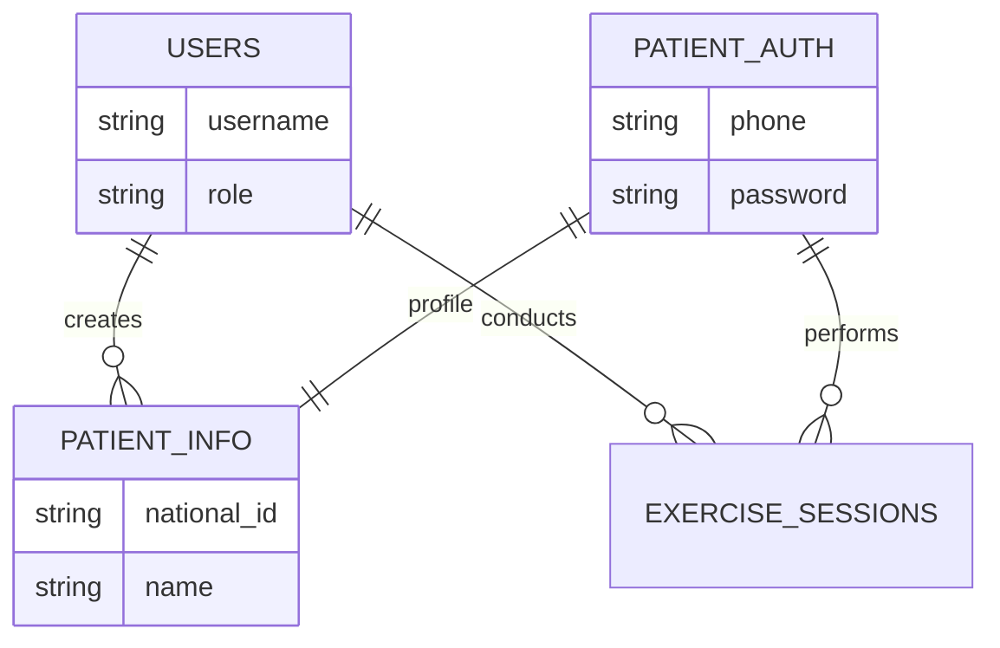

# 🏥 Cardiac Rehab System

ระบบจัดการข้อมูลการฟื้นฟูสมรรถภาพหัวใจ (Cardiac Rehabilitation Management System) พัฒนาด้วย Node.js (Backend) และ Vanilla JS (Frontend)

---

## 👥 Team Members

| Student ID | Name | Role |
|------------|------|------|
| 67026225 | โนชมานิต โกสม | Backend Developer |
| 67021781 | ธัชกร แย้มสังข์ | Frontend Developer |
| 67022209 | ศรรวริชญ์ นิยมสัตย์ | Frontend Developer |
| 67021983 | พัชรพล วราโภค | Backend Developer |

---

## 🛠️ ขั้นตอนการติดตั้ง (Installation Guide)

### ⚙️ Prerequisites (สิ่งที่ต้องติดตั้งก่อน)

ก่อนเริ่มติดตั้ง ต้องมีโปรแกรมเหล่านี้ติดตั้งในเครื่องก่อน:

1. **Node.js** (v14 หรือสูงกว่า)
   - ดาวน์โหลดได้ที่: https://nodejs.org/
   - ตรวจสอบเวอร์ชัน: `node --version`

2. **MySQL** หรือ **XAMPP** (มี MySQL รวมอยู่)
   - XAMPP: https://www.apachefriends.org/download.html
   - MySQL: https://dev.mysql.com/downloads/mysql/

3. **Git** (สำหรับ clone โปรเจค)
   - ดาวน์โหลดได้ที่: https://git-scm.com/

---

### 📥 1. Clone โปรเจค

```bash
git clone <repository-url>
cd projectwebnodejs
```

---

### 📦 2. ติดตั้ง Dependencies

เปิด Terminal/Command Prompt ในโฟลเดอร์โครงการ แล้วรันคำสั่ง:

```bash
cd backend
npm install
```

**Dependencies ที่จะถูกติดตั้ง:**
- `express` - Web framework
- `mysql2` - MySQL client
- `bcrypt` - Password hashing
- `express-session` - Session management
- `cors` - Cross-origin resource sharing
- `dotenv` - Environment variables
- `multer` - File upload handling

---

### 🗄️ 3. ตั้งค่าฐานข้อมูล (Database Setup)

#### 3.1 เปิด MySQL Server
- **ถ้าใช้ XAMPP:** เปิด XAMPP Control Panel → Start MySQL
- **ถ้าใช้ MySQL แยก:** ตรวจสอบว่า MySQL Service รันอยู่

#### 3.2 สร้างฐานข้อมูล
1. เปิด **phpMyAdmin** (http://localhost/phpmyadmin)
2. คลิก **"New"** ด้านซ้าย
3. ตั้งชื่อ Database: `cardiacrehabdb`
4. Collation: `utf8mb4_unicode_ci`
5. คลิก **"Create"**

#### 3.3 Import ข้อมูล
1. เลือก database `cardiacrehabdb`
2. คลิกแท็บ **"Import"**
3. เลือกไฟล์ `backend/cardiacrehabdb.sql`
4. คลิก **"Import"** (ด้านล่างสุด)
5. รอจนเสร็จ - จะได้ตารางทั้งหมด 5 ตาราง

#### 3.4 โครงสร้างฐานข้อมูล
> ดูรายละเอียดโครงสร้างตารางและความสัมพันธ์ได้ที่: **[Database Schema Documentation](database_schema.md)**



**ตารางในระบบ:**
- `users` - ข้อมูลแพทย์, นักกายภาพบำบัด, Admin
- `patient_auth` - ข้อมูลการเข้าสู่ระบบของผู้ป่วย
- `patient_info` - ข้อมูลส่วนตัวผู้ป่วย
- `patient_medical_history` - ประวัติการรักษา
- `exercise_sessions` - บันทึกการออกกำลังกาย

---

### 🔧 4. ตั้งค่า Environment Variables

#### 4.1 สร้างไฟล์ `.env`
ในโฟลเดอร์ `backend/` สร้างไฟล์ชื่อ `.env` (ไม่มีนามสกุล)

#### 4.2 กรอกข้อมูล Configuration

```env
# Server Configuration
PORT=3000

# Database Configuration
DB_HOST=localhost
DB_USER=root
DB_PASS=
DB_NAME=cardiacrehabdb

# Session Secret (เปลี่ยนเป็นค่าที่ปลอดภัยกว่านี้ตอน production)
SESSION_SECRET=super_secret_key_change_this_in_production
```

---

### 🔐 5. Add/Delete/Edit  User

```bash
http://localhost:3000/html/manage_users.html
```


## 🚀 การรันระบบ (Launch Website)

1. ในโฟลเดอร์ `backend/` รันคำสั่ง:
   ```bash
   node server.js
   ```
2. เข้าใช้งานผ่าน Browser ที่ URL: `http://localhost:3000`

---

## 👥 คู่มือการใช้งานแยกตามสิทธิ์ (User Guide)

### 👨‍⚕️ สิทธิ์: แพทย์ (Doctor)
- **เข้าสู่ระบบ:** ใช้ Username และ Password ที่กำหนด (เช่น `sitha` / `sitha123`)
- **จัดการผู้ใช้:** สามารถเพิ่ม แก้ไข หรือลบข้อมูล หมอ และ นักกายภาพบำบัด ได้ในเมนู Management
- **เพิ่มข้อมูลผู้ป่วย:** กรอกรายละเอียดผู้ป่วยใหม่ (ชื่อ, เบอร์โทร, เลขบัตรประชาชน, อาการ, ประวัติการรักษา)
- **ดูประวัติ:** ติดตามผลการออกกำลังกายของผู้ป่วยทุกคนในระบบ

### ⛹️‍♂️ สิทธิ์: นักกายภาพบำบัด (Physical Therapist)
- **เข้าสู่ระบบ:** ใช้ Username และ Password ที่กำหนด (เช่น `thanida` / `thanida123`)
- **บันทึกกิจกรรม:** บันทึกข้อมูลการออกกำลังกาย (Heart Rate, Blood Pressure, METs, วิธีการออกกำลังกาย)
- **อัปโหลด EKG:** สามารถอัปโหลดรูปภาพผล EKG เพื่อประกอบการบันทึก
- **คำแนะนำ:** ให้คำแนะนำสำหรับเซสชันถัดไป

### 🤒 สิทธิ์: ผู้ป่วย (Patient)
- **เข้าสู่ระบบ:**
  - **Username:** หมายเลขโทรศัพท์ (Phone Number)
  - **Password:** เลขบัตรประจำตัวประชาชน 13 หลัก (National ID)
- **ดูข้อมูลส่วนตัว:** ตรวจสอบข้อมูลประวัติสุขภาพของตนเอง
- **ดูประวัติการออกกำลังกาย:** ดูรายละเอียดที่นักกายภาพบันทึกไว้ และอ่านคำแนะนำในการปฏิบัติตัว

---
