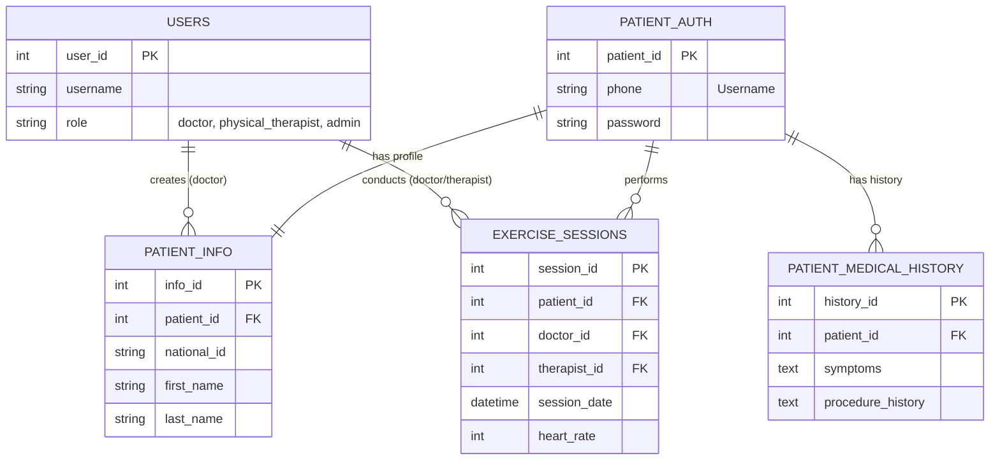

# Database Schema Documentation

## Overview
The database `cardiacrehabdb` consists of 5 normalized tables designed to manage patient data, authentication, medical history, and exercise sessions securely and efficiently.

## ER Diagram

## Table Definitions

### 1. `users`
Stores staff account information (Doctors, Physical Therapists, Admins).
- **user_id** (PK): Unique ID.
- **username**: Login username.
- **password**: Bcrypt hashed password.
- **role**: Enum ('doctor', 'physical_therapist', 'admin').
- **first_name**, **last_name**, **email**, **phone**: Staff personal details.

### 2. `patient_auth`
Stores patient login credentials. Segregates security sensitive data.
- **patient_id** (PK): Unique ID.
- **phone**: Unique phone number (Used as Username).
- **password**: Bcrypt hashed password (National ID is used as default password during registration).

### 3. `patient_info`
Stores patient personal and demographic information.
- **info_id** (PK): Unique ID.
- **patient_id** (FK): Links to `patient_auth`.
- **national_id**: unique Thai National ID.
- **first_name**, **last_name**: Patient name.
- **date_of_birth**, **gender**: demographics.
- **created_by` (FK): Links to `users` (The doctor who registered the patient).

### 4. `patient_medical_history`
Stores medical background and initial assessment data.
- **history_id** (PK): Unique ID.
- **patient_id** (FK): Links to `patient_auth`.
- **symptoms**: Current symptoms.
- **procedure_history**: Past medical procedures.
- **weight**, **height**, **age**: basic anthropometrics.
- **cpet_completed**: Boolean flag.

### 5. `exercise_sessions`
Stores data from each rehabilitation session.
- **session_id** (PK): Unique ID.
- **patient_id** (FK): Links to `patient_auth`.
- **session_number**: Sequential number of the session for the patient.
- **session_date**: Date and time of session.
- **doctor_id** (FK): Responsible doctor (from `users`).
- **therapist_id** (FK): Responsible therapist (from `users`).
- **Vitals**: `heart_rate`, `bp_systolic`, `bp_diastolic`.
- **Metrics**: `mets`, `duration_minutes`, `intensity_level`.
- **Details**: `exercise_method`, `recommendations`, `notes`.
- **ekg_image_path**: Path to uploaded EKG image file.
